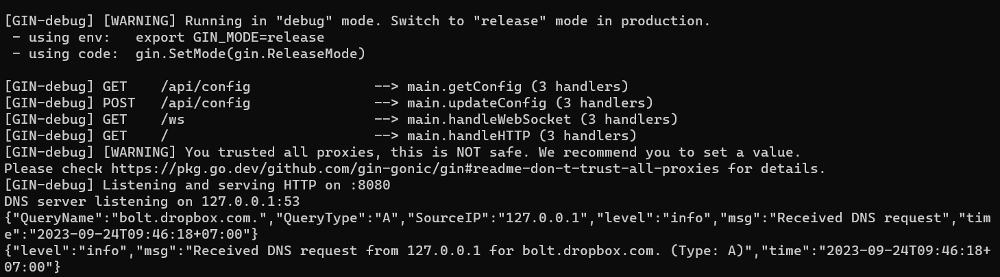

# kdns

kdns is a local DNS server and traffic inspection tool designed to help you monitor and analyze DNS traffic on your localhost. This tool provides a REST API for querying and modifying DNS configuration information and a real-time web interface for visualizing DNS logs.

## Motivation

Inspecting DNS traffic can be essential for understanding how your applications resolve domain names and identifying any potential issues. kdns aims to simplify the process of modifying DNS records, monitoring DNS queries and responses on your local system.

## Features

- External DNS Resolver support
- DNS Record Customization 
- REST API for querying and chaning DNS configuration
- Real-time web interface for visualizing DNS logs
- Fast, simple, and easy-to-use 

## REST API Documentation

The REST API provided by kdns allows you to retrieve DNS information programmatically. Here are some of the available endpoints:

- **GET http://localhost:8080/api/config**: Retrieve current kdns configuration.
- **POST http://localhost:8080/api/config**: Update kdns configuration.


## Usage

kdns offers a real-time web interface for visualizing DNS logs. To view the web interface, follow these steps:

1. Clone this repository:

   ```shell
   git clone https://github.com/karfianto/kdns.git
   cd kdns
   ```

2. Build the package
 
    ```shell
    go build
    ```

3. Run the binary

    ```shell
    kdns.exe
    ```
    

4. Open your host Network Adapter Setting and change your DNS Server to `127.0.0.1`

    

5. Open your web browser and visit `http://localhost:8080` to access the real-time web interface.

    

## How to Contribute
Contributions to kdns are welcome and encouraged! Here's how you can contribute:

1. Fork the repository to your GitHub account.
2. Create a new branch for your feature or bug fix:
    ```shell
    git checkout -b feature/my-feature
    ```
3. Make your changes and commit them with clear commit messages.
4. Push your changes to your fork:
    ```shell
    git push origin feature/my-feature
    ```
5. Create a pull request (PR) against the main branch of this repository.
